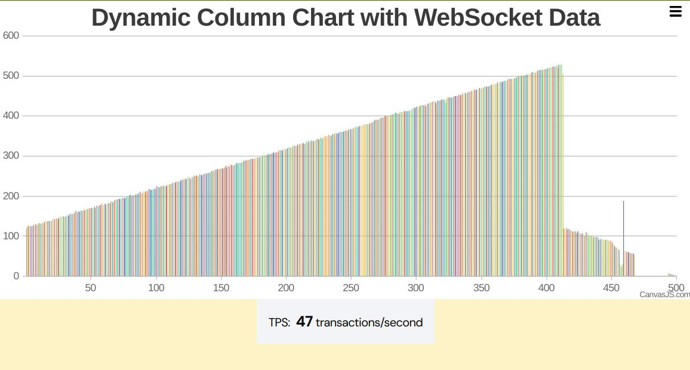

# subnet-vm


## Description

**Subnet-VM** is an advanced parallel functional virtual machine designed for high-efficiency computations and safe concurrency management. By utilizing [Block Software Transactional Memory](https://en.wikipedia.org/wiki/Software_transactional_memory) (STM), Subnet-VM ensures safe handling of concurrent transfers between shared data, effectively preventing conflicts and ensuring data integrity.


## Features
- **Concurrency Management:** Implements block STM mechanism to prevent conflicts in concurrent tasks. This ensures that multiple transactions can be executed in parallel without data corruption or race conditions.

- **Parallel Processing:** Utilizes [HVM2 run time](https://github.com/higherorderco/hvm) for efficient parallel computations. This allows Subnet-VM to handle a high volume of tasks simultaneously, optimizing performance and throughput.

- **Written in Rust:** Leverages Rust's safety and concurrency features. Rust’s ownership model, type system, and memory safety guarantees make it an ideal choice for developing a reliable and efficient virtual machine.


## Usage
1. Clone the repository:
   ```sh
   git clone https://github.com/unicornultralabs/subnet-vm.git
   ```

2. Install hvm 2 runtime:
   ```sh
   cargo install hvm@2.0.17
   ```

3. Run the machine:
   ```sh
   cargo run
   ```


## Benchmark




## Contributing
Contributions are what make the open source community such an amazing place to learn, inspire, and create. Any contributions you make are **greatly appreciated**.